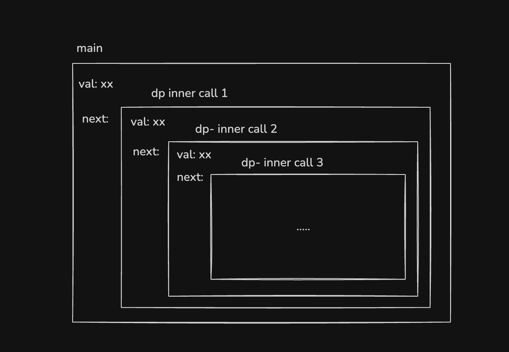

# Add Two Numbers
- https://leetcode.com/problems/add-two-numbers/


## Step 1 - Thought of DP
TBH, I don't know wtf DP is...  
but I keep hearding it: 
> DP is you make the problem to smaller problem,  
> and solve it.  

Anyway, cut my bullshit.  
So every time we travel through the node,  
we need to doing below steps：  

### Calculate the value of current node
According to the problem, `L1` and `L2` won't be same length  
so we need to check if `L1` or `L2` is null  
the cleanest way is like below  
```Typescript
let result = 0
if(L1) result += L1.val
if(L2) result += L2.val
if(overflow){
  result += 1 
}
```
### Handle overflow 
If the current value is bigger than 10, we need to handle the overflow
I'm using a boolean to mark it's overflow or not
```Typescript
let overflow = false
if(result >= 10){
  result = result % 10
  overflow = true
}else{
  overflow = false
}
```
After peaking the answer  
I saw a better way to handle overflow  
```Typescript
let overflow = 0
if(result >= 10){
  result = result % 10
  overflow = result / 10
}else{
  overflow = 0
}
```
Above snippet can be carry more than 1  
But no need to handle more than 1 in this problem.  
Cuz: `0 <= Node.val <= 9`  
Maximum value of `result` is `18`  


### Create Node
After we calculate the value of current node,  
we need to create a new node and store the value in it  
```Typescript
let newNode = new ListNode()
newNode.val = result
newNode.next = ???
```
Next node should be go through above all the steps  
So we need to pass all the value we need then call the dp function again

### Recursion
```Typescript
function dp(l1: ListNode | null, l2: ListNode | null, isOverflow: boolean) {
  // do something
}
```

As long as we have next node, the calling will keep nesting 
  


## Step 2 - Submit then handle corner case
The first submit end up with time limit exceeded  
cuz I forgot to end the recursion  
So we need to add below condition inside dp function
```Typescript
if(!l1 && !l2) return null
```

The Second submit end up with wrong answer  
cuz I forgot to handle if last node is overflow  
So need to create a new node with value 1
Then we need update above condition
```Typescript
if(!l1 && !l2 && !isOverflow) return null
```

## Step 3 - Conculsion
> DP IS GOOD  
